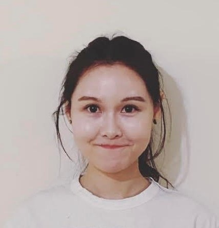

## About Me

I am Cass Zhixue Zhao, a lecturer in [Natural Language Processing](https://www.sheffield.ac.uk/dcs/research/groups/natural-language-processing) at the Computer Science Department of the University of Sheffield. My long-term research goal is to enable trustworthy, responsible, and efficient NLP models. These days, I am interested in anything related to **interpretability** and **large language models** (LLMs). My recent research projects focus on **model compression**, **model editing**, and **text-to-image models**.

Previously, I worked as a Postdoc researcher on explainable AI and responsible AI. The overarching aim is to demystify predictions made by black-box LLMs, making them easier to understand and trustworthy. The work also addresses model hallucination to ensure the reliability of LLMs, alongside exploring model compression techniques that mitigate compute demands and thus foster inclusivity within NLP research. Back in 2020, I worked as a research assistant within the same department, working on NIHR-funded NLP projects for systematic reviews of public health research. My Ph.D. research, which was funded by the University of Sheffield, looked at transfer learning and mitigating model bias for hate speech detection.

Test
Test

I am looking for highly motivated PhD students. Two funded PhD positions for 3.5 years are available, one on UKRI rate and one on UKRI for both the UK and overseas. Welcome to [apply](https://www.findaphd.com/phds/project/finding-the-needle-in-the-ocean-multimodal-retrieval-systems-for-unstructured-data-s3-5-com-zhao/?p178069) directly or contact me first. CSC or Self-funding with your own topic is welcome too.

Test
Test

## Selected Publications

Leixin Zhang, Yinjie Cheng, WEIHE ZHAI, Steffen Eger, Jonas Belouadi, Fahimeh Moafian, **Zhixue Zhao**. ScImage: How good are multimodal large language models at scientific text-to-image generation? The Thirteenth International Conference on Learning Representations. ICLR2025

Paul Youssef, **Zhixue Zhao**, Jörg Schlötterer, Christin Seifert. 2025. Can We Reverse In-Context Knowledge Edits? The 2025 Annual Conference of the Nations of the Americas Chapter of the ACL. NAACL2025

Paul Youssef, **Zhixue Zhao**, Jörg Schlötterer, Christin Seifert. 2025. Has this Fact been Edited? Detecting Knowledge Edits in Language Models? The 2025 Annual Conference of the Nations of the Americas Chapter of the ACL. NAACL2025

George Chrysostomou, **Zhixue Zhao**, Miles Williams, and Nikolaos Aletras. 2024. Investigating Hallucinations in Pruned Large Language Models for Abstractive Summarization. 2024 Transactions of the Association for
Computational Linguistics. [TACL Vol. 12 (2024)](https://transacl.org/index.php/tacl/article/view/6271)

**Zhixue Zhao**, James Thomas, Gregory Kell, Claire Stansfield, Mark Clowes, Sergio Graziosi, Jeff Brunton, Iain James Marshall, Mark Stevenson. The FAIR database: facilitating access to public health
research literature. [JAMIA Vol.7 4(2024)](https://doi.org/10.1093/jamiaopen/ooae139)

**Zhixue Zhao** and Nikolaos Aletras. 2024. Comparing Explanation Faithfulness between Multilingual and Monolingual Fine-tuned Language Models. 2024 Annual Conference of the North American Chapter of the Association for Computational Linguistics. [NAACL 2024 Main](https://arxiv.org/pdf/2403.12809) (oral presentation)

**Zhixue Zhao** and Nikolaos Aletras. 2024. Incorporating Attribution Importance for Improving Faithfulness Metrics. The 61st Annual Meeting of the Association for Computational Linguistics.
[ACL 2023 Main](https://aclanthology.org/2023.acl-long.261/)
[[Oral Presentation](https://us06web.zoom.us/rec/play/TisLvdRrfqNRYts4y0A6wJeoV2H6kL2eRywX7Jl_wGUxBVO_n_HoIfVi1lhO0OK1sUw-gDjFpHuuDz6o.-zDGXXlaq7nOwrW7?canPlayFromShare=true&from=share_recording_detail&continueMode=true&componentName=rec-play&originRequestUrl=https%3A%2F%2Fus06web.zoom.us%2Frec%2Fshare%2Fc0BepePE3QACrdQQpFnEISDmrUSvV5T7XwJcW1TN0jkGEvVMutm55KeLx9eKWXH4.R0SYaV552qVO0sfV) (the 1st talk was ours)]

**Zhixue Zhao**, George Chrysostomou, Kalina Bontcheva, and Nikolaos Aletras. 2022. On the Impact of Temporal Concept Drift on Model Explanations. In Findings of the Association for Computational Linguistics [EMNLP 2022 Findings](https://aclanthology.org/2022.findings-emnlp.298/)

**Zhixue Zhao**, Ziqi Zhang, and Frank Hopfgartner. 2022. Utilizing Subjectivity Level to Mitigate Identity Term Bias in Toxic Comments Classification. Online Social Networks and Media, 29, 100205. [Journal](https://www.sciencedirect.com/science/article/abs/pii/S246869642200009X)

**Zhixue Zhao**, Ziqi Zhang, and Frank Hopfgartner. 2021. A Comparative Study of Using Pre-trained Language Models for Toxic Comment Classification. In Companion Proceedings of the Web Conference 2021 (pp. 500-507) [WWW 2021](https://dl.acm.org/doi/abs/10.1145/3442442.3452313#:~:text=Our%20results%20show%20that%2C%20Out,such%20as%20CNN%20and%20BiLSTM.)

(More papers in [publications](https://casszhao.github.io/cass/publications).)

Test
Test

Test
## Project
- Co-PI of [ExU](https://exuproject.sites.sheffield.ac.uk/)
