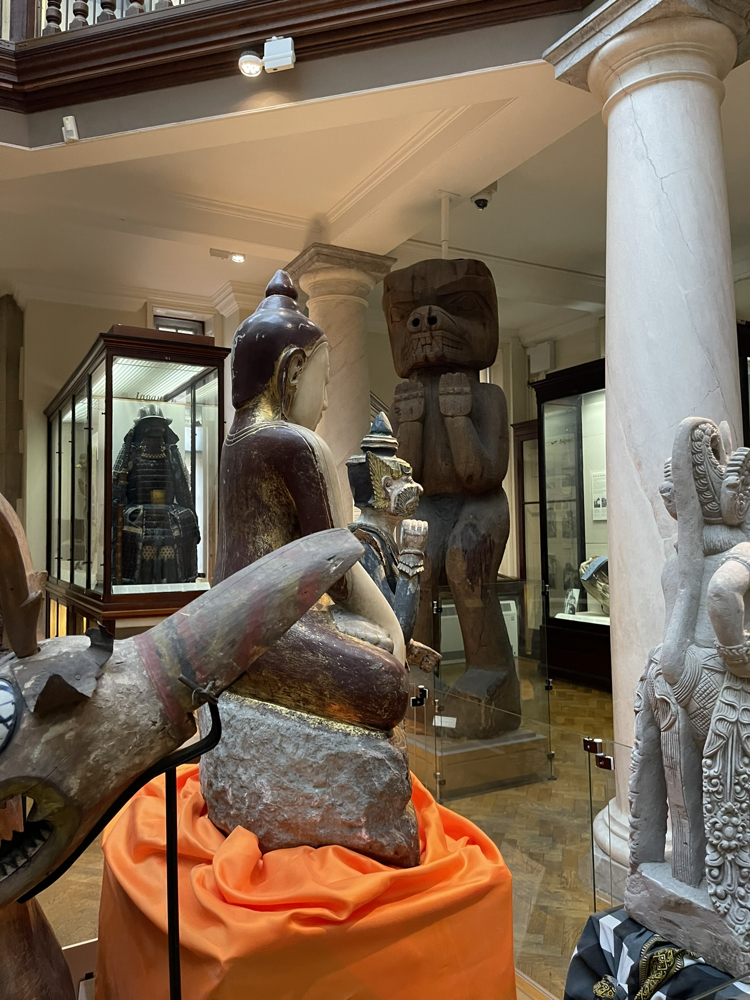
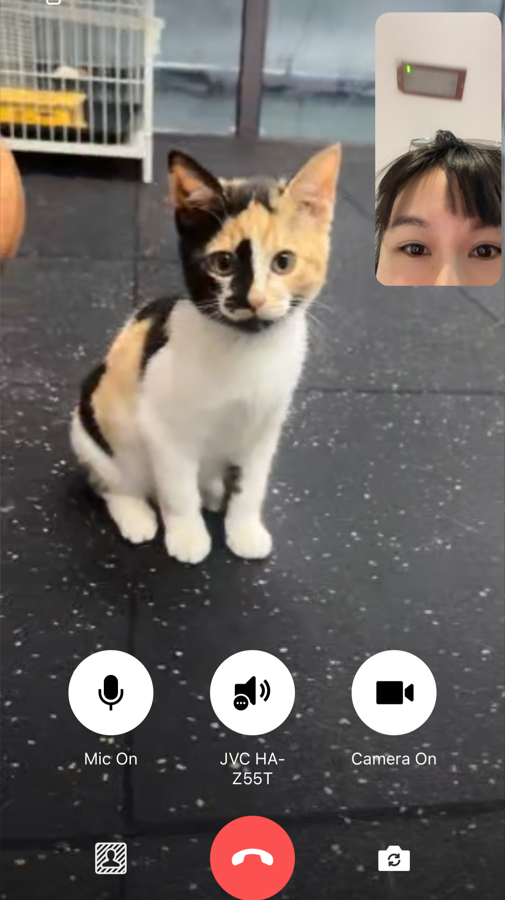

# Beyond research

Life in academia can sometimes be tough, particularly for juniors. One thing that helps us stay calm and move forward is doing research we are passionate about or have faith in, hopefully. Because there will be unexpected negative things (more than tough reviewer 2), passion will help us survive. 

On top of that, seeing the beauty in life works for me. So I occasionally update the things that make me happy here. 🍧	🎂 	🍰 

### No Category

I feel him/her

### DOGS & CATS 

she is the cutest

"huh?"

---
© 2024 Cass. Photos by Cass.
